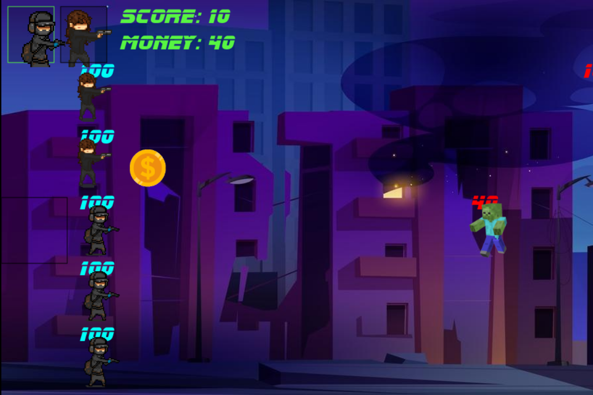

# Tower Defense: Soldiers vs Meme Zombies!
#### An browser based game inspired by the classic tower defense strategy game: Plants vs Zombies 

---

### Tutorial and Rules:
1. You must kill all enemies to win each level!
2. If a single enemy breaks through your defenses, you lose!
3. Each hero costs 100 money to train, so train wisely!
4. On top left side of canvas you can click to choose a hero to play as.
5. Money will randomly appear on canvas at random intervals. Hover over them to get it! 
6. Click anywhere on canvas to place hero. You can choose up to 2 heroes to play (one at a time). 

---

#### Programming Languages Used: 
* JavaScript
* HTML 
* CSS 

---
Link to game: [Click here](https://moris96.github.io/tower-defense-game/index.html)

---

#### 
Other Notes: 
* This game was programmed heavy on OOP (object oriented program) to demonstrate the powerful capabilities of JavaScript. Had to create classes for heroes, enemies, lasers, money, and hover messages & methods for each to draw the on the canvas and animate them. Most of the code is used in JavaScript since I used the html canvas tag (which is popular with browser games)
* Challanges: 
    * Styling & CSS. My current weakness as of September 18, 2022 is visual art & styling a web page to make it look nice and artistic. I am a backend person and my strength is in JavaScript (the brains of the project)
    * I could not find free sprites for characters and enemies that would fit with the style of the game. This was a class project, but still an unfinished product as of September 20, 2022. I will continue to improve the game at later dates. 
* This game was designed to be both challenging and funny. Have fun playing!

---
